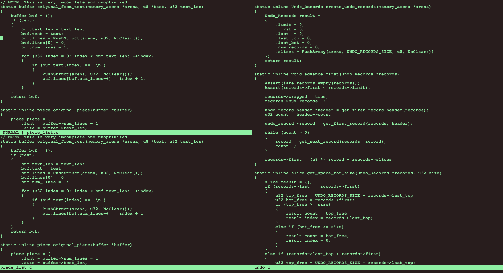

# Simple Editor

Linux based terminal text editor.



## Features

- Modal editor (vim-like motions).
- Multi window layout.
- Search and Replace (no regex).
- utf8-aware.

## Build

```console
$ bash build.sh
$ ./build/e filename
```
## Dependencies

- [utf8proc](https://juliastrings.github.io/utf8proc/)

## Working on

- Syntax highlighting
- File manager
- Gui frontend (opengl)
